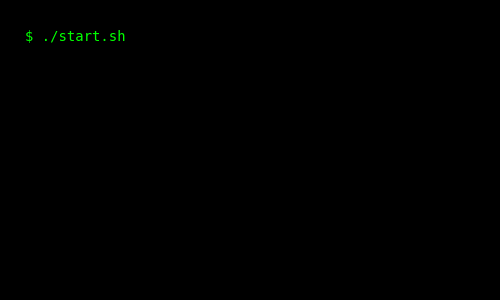

# MATRIX-BOOT-ME

> 💻 A futuristic boot sequence generator written in Python — perfect for intros, resumes, or terminal-style animations.



---

## ✨ Overview

`MATRIX-BOOT-ME` is a lightweight Python script that generates a terminal-inspired animated GIF, simulating a neural system startup and shutdown.  
It features personalized identity, tech stack, and contact information — all typed out character by character in a retro-futuristic terminal aesthetic.

---

## 🧰 Requirements

Install the required packages with:

```bash
pip install matplotlib pillow
```

or

```bash
pip install -r requirements.txt
```

---

## 🚀 Usage

Run the script:

```bash
python main.py
```

The generated animation will be saved as:

```txt
output.gif
```

---

## ⚙️ Customization

You can easily configure the following in `main.py`:

### 🔹 Boot / Shutdown Messages

Modify the `BOOT_LINES`, `CONTINUE_LINES`, `DISENGAGE_LINE`, and `SHUTDOWN_LINES` constants to customize the startup and shutdown sequences.

### 🔹 Personal Information

Edit the `MAIN_INFO` constant to include your name, title, links, contact details, or anything else you’d like to type out character by character.

### 🔹 Encryption / Scrambling Animation

Customize the animation blocks by changing:

- `ENCRYPT_BASE`, `SCRAMBLE_BASE` (messages shown)
- Block count in `render_block_animation()` calls

### 🔹 Typing & Animation Speeds

Control the animation pacing using constants:

- `TYPING_SPEED`
- `ENCRYPT_SPEED`
- `SCRAMBLE_SPEED`
- `SHUTDOWN_SPEED`
- `FINAL_HOLD_DURATION`

> 💡 Smaller speed values result in faster animation.

### 🔹 Visual Style

Modify visual output using:

- `FONT_COLOR`, `BG_COLOR`, `FONT_SIZE`, `FONT_FAMILY`
- Output size: `IMAGE_WIDTH`, `IMAGE_HEIGHT`
- Max visible lines: `MAX_VISIBLE_LINES`
- Typing cursor character (inside `render_typing_animation`)

### 🔹 GIF Output & Frame Handling

Set the output path using `GIF_PATH`.  
Temporary frame images are cleaned up automatically — comment out the `shutil.rmtree()` line to keep them.

## 📄 License

[MIT License](LICENSE)
