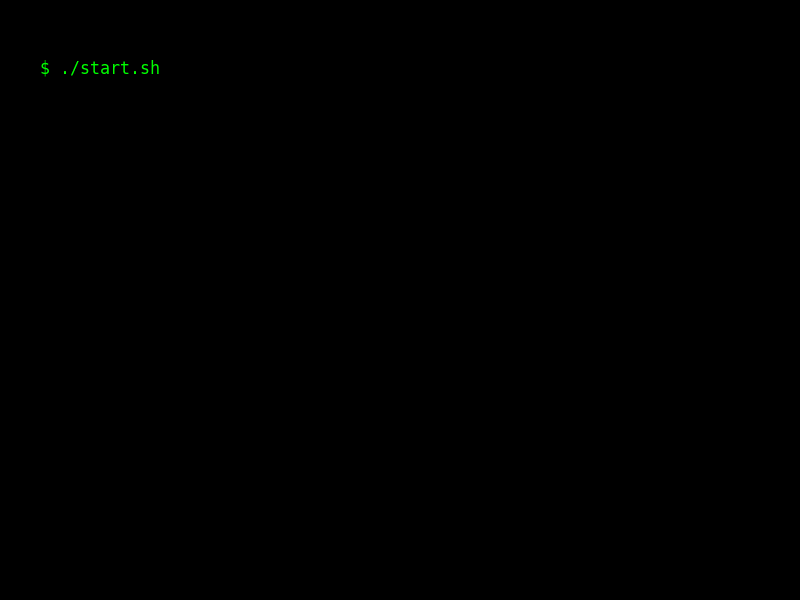

# MATRIX-BOOT-ME

> 💻 A futuristic boot sequence generator written in Python — perfect for intros, resumes, or terminal-style animations.



---

## ✨ Overview

`MATRIX-BOOT-ME` is a lightweight Python script that generates a terminal-inspired animated GIF, simulating a neural system startup and shutdown.  
It features personalized identity, tech stack, and contact information — all typed out character by character in a retro-futuristic terminal aesthetic.

---

## 🧰 Requirements

Install the required packages with:

```bash
pip install matplotlib pillow
```

or

```bash
pip install -r requirements.txt
```

---

## 🚀 Usage

Run the script:

```bash
python main.py
```

The generated animation will be saved as:

```txt
hybrid_typing_intro.gif
```

---

## ⚙️ Customization

You can easily configure the following in `main.py`:

### 🔹 Boot / Shutdown Messages

Modify the `boot_lines`, `boot_continue`, and `shutdown_lines` lists to customize the startup and shutdown sequences.

### 🔹 Personal Information

Edit the `main_text` block to include your name, title, links, contact details, or anything else you’d like to type out character by character.

### 🔹 Encryption / Scrambling Animation

Adjust `encrypt_base`, `scramble_base`, `num_blocks`, or even replace the animation style with your own.

### 🔹 Typing & Animation Speeds

Customize frame delays using constants like:

- `TYPING_SPEED`  
- `ENCRYPT_SPEED`  
- `SCRAMBLE_SPEED`  
- `SHUTDOWN_SPEED`  
- `FINAL_HOLD_DURATION`

### 🔹 Visual Style

Tweak the visual presentation via:

- `FONT_COLOR`, `BG_COLOR`, `FONT_SIZE`, `FONT_FAMILY`  
- Terminal size: `IMAGE_WIDTH`, `IMAGE_HEIGHT`  
- Line limit: `MAX_VISIBLE_LINES`

### 🔹 GIF Output & Frame Handling

Change the output filename via `GIF_PATH`, or disable cleanup by commenting out the `shutil.rmtree()` call at the end of the script.

## 📄 License

MIT License
